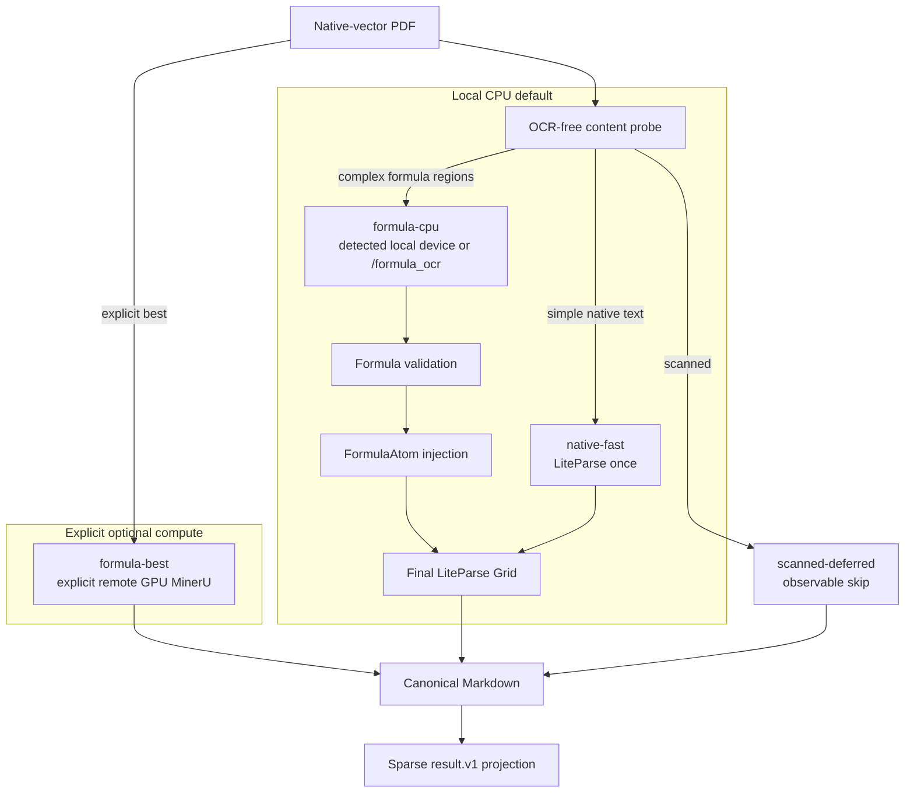

# research-pdf-parser

One public, CPU-first parser for native-vector announcements and formula-heavy
research reports. LiteParse owns extraction, tables, reading order, Grid, and
Markdown. The high-level package adds content routing, formula recognition and
validation, optional GPU acceleration, and a stable result contract.

Scanned pages are logged and deferred. They are never silently emitted as empty
Markdown, and this package never enables LiteParse OCR.

## Start here

```bash
git clone https://github.com/GlacierAlgo/research-pdf-parser.git
cd research-pdf-parser/packages/research-pdf-parser
uv sync --group dev

# Recommended: probe, route, and parse locally.
uv run research-pdf parse auto input.pdf -o output.md

# Explain the route without loading a formula model.
uv run research-pdf probe input.pdf
```

The default product output is exactly one canonical Markdown file. Extra files
appear only when requested (`--result-json`, `--images embed`) or when a complex
formula needs crop evidence/image fallback.

## Production profiles

| Profile | Selected by `auto` | Compute | Contract |
| --- | ---: | --- | --- |
| `native-fast` | yes | local CPU | one OCR-free LiteParse pass; best for announcements |
| `formula-cpu` | yes | detected local CPU/GPU or HTTP formula service | crop only formula regions, validate candidates, inject `FormulaAtom`, rebuild final Grid |
| `formula-best` | no | explicit remote GPU worker | detect GPU, run MinerU hybrid high over SSH, then deterministic local cleanup |
| `scanned-deferred` | yes | none | structured warning and readable skip marker; no OCR |

`auto` is content-derived and never selects a remote worker. A local formula
runtime uses a compatible GPU when detected and otherwise uses CPU. Source labels such as “announcement”
or “research report” are budget hints, not routing truth.

```bash
uv run research-pdf parse native-fast announcement.pdf -o announcement.md
uv run research-pdf parse formula-cpu report.pdf -o report.md
uv run research-pdf parse formula-cpu report.pdf --no-formula-model -o fallback.md
uv run research-pdf parse formula-best report.pdf --gpu-host gpu-worker -o best.md
```

Use `--pages 1,4-5` on local profiles. `formula-best` currently processes the
complete document.

## Formula inference

Install local PP-FormulaNet support:

```bash
uv sync --extra formula-cpu
```

The in-process path detects a Paddle-compatible GPU and otherwise stays on CPU.
It uses `PP-FormulaNet_plus-S` first, buckets crops by size, batches them, and
sends rejected candidates to `PP-FormulaNet_plus-M`. Force the choice with
`--formula-device cpu|gpu`, or keep the default `auto`.

Remote formula inference uses a machine-neutral LiteParse-style endpoint. The
client sends one crop per `multipart/form-data` request and accepts the standard
`results[{text,bbox,confidence}]` response:

```bash
RESEARCH_PDF_PARSER_FORMULA_URL=http://10.0.0.8/formula_ocr \
  uv run research-pdf parse auto report.pdf -o report.md
```

The remote service owns GPU detection, model loading, batching and admission;
the parser never infers hardware from an IP or hostname. A local reference
implementation is included:

```bash
uv run research-pdf serve formula --device auto
# POST http://127.0.0.1:8765/formula_ocr
```

The reference service has no built-in authentication and binds to localhost by
default. Expose it only on a trusted network or behind an authenticated proxy.

Model output is never accepted blindly. Structural checks, native-text anchors,
identifier preservation, confidence, and formula-specific rules decide whether
LaTeX is injected. Rejected output remains a crisp vector crop, so Markdown stays
visually readable.

## Python API and result contract

```python
from pathlib import Path

from research_pdf_parser import parse_pdf

result = parse_pdf(Path("report.pdf"), Path("report.md"), profile="auto")
print(result.actual_profile, result.quality.status)
```

`ParseResult` uses schema `research-pdf-parser.result.v1` and contains route
reasons, versions, timings, warnings, quality, and sparse typed blocks. Blocks
point into canonical Markdown using stable character spans; they do not copy a
second complete document. Materialize this optional adapter payload with
`--result-json result.json`.

Formula profiles may create:

```text
report.md
report_assets/
  cpu_report.md
  formula_manifest.jsonl
  formulas/
  images/
```

Formula evidence includes stable id, page, bbox, source, confidence, validation
flags, crop path, and crop SHA-256. Downstream factor reproduction must validate
LaTeX-to-DSL mappings independently.

## Architecture



Consumers depend in one direction:

- personal use and AlphaSeeker call this package/API directly;
- `shadow-local-agents` adapts `ParseResult` to Lighthouse writeback;
- `shadow-lighthouse` stores/indexes results but never loads parser/model code;
- AlphaSeeker and Shadow never import one another.

See [feature status](docs/feature-status.md),
[formula OCR API](docs/formula-ocr-api.md),
[result/storage contract](docs/result-contract.md), and
[consumer integration](docs/integrations.md).

## Verification

```bash
uv sync --group dev
uv run pytest
uv run ruff check src tests
uv build

cd ../..
cargo fmt --all -- --check
cargo test -p liteparse --lib --no-default-features
```

Licensed under Apache-2.0.
