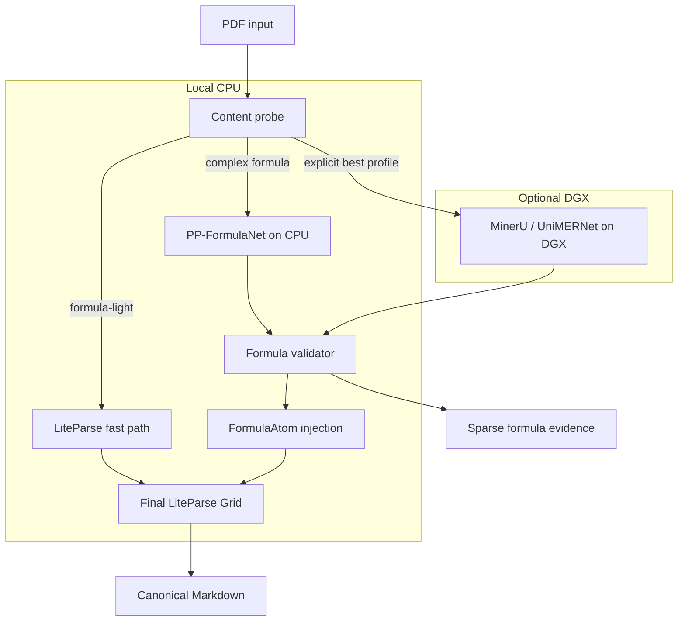

# research-pdf-parser

CPU-first PDF-to-Markdown parsing for native-vector announcements and research
reports. The fast path uses LiteParse once. Formula-heavy reports use local
vector crops, a specialized formula recognizer, validation, and `FormulaAtom`
injection before LiteParse's final Grid and Markdown classification pass.

This is an early usable release, not a general OCR engine. Scanned PDFs are
logged and skipped. The canonical result is Markdown. `native-fast` keeps a
single Markdown file by default; pass `--images embed` when source images are
materially useful. Formula profiles create an adjacent `_assets` directory only
for source images, formula evidence, or visual formula fallbacks.

## Profiles

| Profile | Compute | Intended input | Behavior |
| --- | --- | --- | --- |
| `native-fast` | local CPU | announcements and formula-light PDFs | one LiteParse pass, OCR disabled |
| `formula-cpu` | local CPU | native-vector research reports | PP-FormulaNet proposal, structural validation, final Grid injection |
| `formula-best` | optional DGX | difficult formulas and layouts | MinerU/UniMERNet over SSH, then local Markdown packaging |

On the 32-page development report, the formula CPU path took 83.8 seconds:
0.512 seconds for the initial LiteParse pass, 0.252 seconds for final Grid
injection, and 67.560 seconds for formula inference. It found 196 native
formulas and routed 47 regions to vision; 25 passed LaTeX validation and 22 used
crisp vector-crop fallbacks. These numbers are a reference workload, not a
general benchmark.

## Install

The patched LiteParse core and this high-level package are versioned in the same
repository. Clone once and install from the package workspace:

```bash
git clone https://github.com/GlacierAlgo/research-pdf-parser.git
cd research-pdf-parser
cd packages/research-pdf-parser
uv sync
uv run research-pdf doctor --strict
```

Install the optional local formula model:

```bash
uv sync --extra formula-cpu
```

## CLI

The command tree uses Click and `RecursiveHelpGroup`, preserving the compact
nested help style used in the author's other tools:

```bash
uv run research-pdf --help
uv run research-pdf parse native-fast announcement.pdf -o announcement.md
uv run research-pdf parse native-fast illustrated.pdf --images embed -o illustrated.md
uv run research-pdf parse formula-cpu report.pdf -o report.md
uv run research-pdf parse formula-cpu report.pdf --no-formula-model -o report-fallback.md
uv run research-pdf parse formula-best report.pdf --dgx-host dgx-aliyun -o report-best.md
```

Use `--pages 1,4-5` for a page subset. The CPU formula profile never treats OCR
LaTeX as truth: only structurally and textually validated output becomes a
LaTeX atom. Rejected output becomes a vector-rendered image atom, preserving a
human-readable Markdown result.

`formula-cpu` writes a sparse evidence bundle next to the Markdown:

```text
report.md
report_assets/
  cpu_report.md
  formula_manifest.jsonl
  formulas/
  images/
```

The manifest records stable formula IDs, page/bbox, source crop, context,
engine, confidence, and validation reasons. Consumers such as AlphaSeeker must
validate formula-to-DSL mappings independently before execution.

## Architecture



The boundary is deliberate:

- `crates/liteparse` and `packages/python` own vector extraction, layout
  probing, tables, Grid projection, Markdown classification and the Python
  binding.
- This package owns routing, local/DGX inference, validation, storage, and the
  public CLI.
- Downstream projects import this package or call its CLI; they do not patch
  LiteParse independently.

## Development

```bash
uv sync --group dev
uv run pytest
uv run ruff check src tests
uv build
```

The LiteParse core is tested from the repository root:

```bash
cd ../..
cargo fmt --all -- --check
cargo test -p liteparse --lib --no-default-features
```

Licensed under Apache-2.0.
