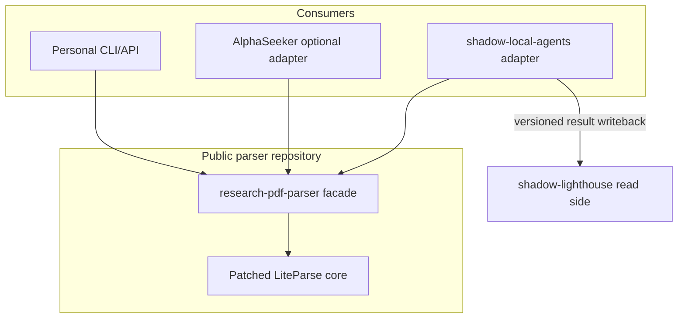

# Consumer integration boundaries

## Personal use

Use the CLI or `parse_pdf()`. `auto` is the default. Keep `--result-json` off
unless inspecting routing or integrating another process.

## AlphaSeeker

Use an optional dependency/adapter or external command because the parser is not
part of AlphaSeeker's core installation. Temporary, unmanaged PDFs may be parsed
directly. For managed documents, read the stored Lighthouse result instead of
parsing the same bytes again.

AlphaSeeker owns formula-to-DSL mapping, variable/operator resolution, sample
calculation, and reproduction validation. It must not execute OCR LaTeX as truth.

## Shadow

`shadow-local-agents` owns parser execution and adapts `ParseResult` into the
existing Lighthouse writeback contract. Lightweight workers consume
`native-fast`; formula workers consume `formula-cpu`; DGX workers lease only
explicit complex jobs.

`shadow-lighthouse` owns leases, idempotent result writeback, durable evidence,
indexes, quality/review state, and read APIs. It does not import this parser or
load PDF/model runtimes. Octopus continues to own raw objects only.

## Dependency direction

No consumer business fields belong in the public parser, and AlphaSeeker and
Shadow never import each other.
